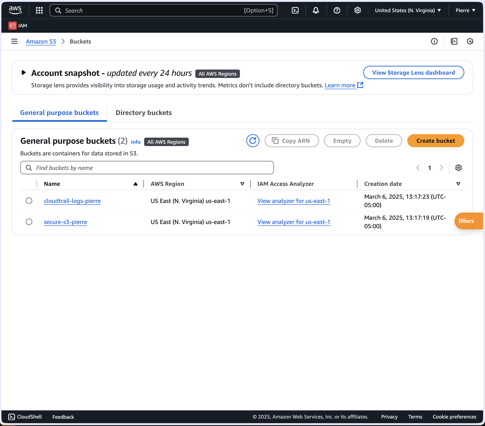
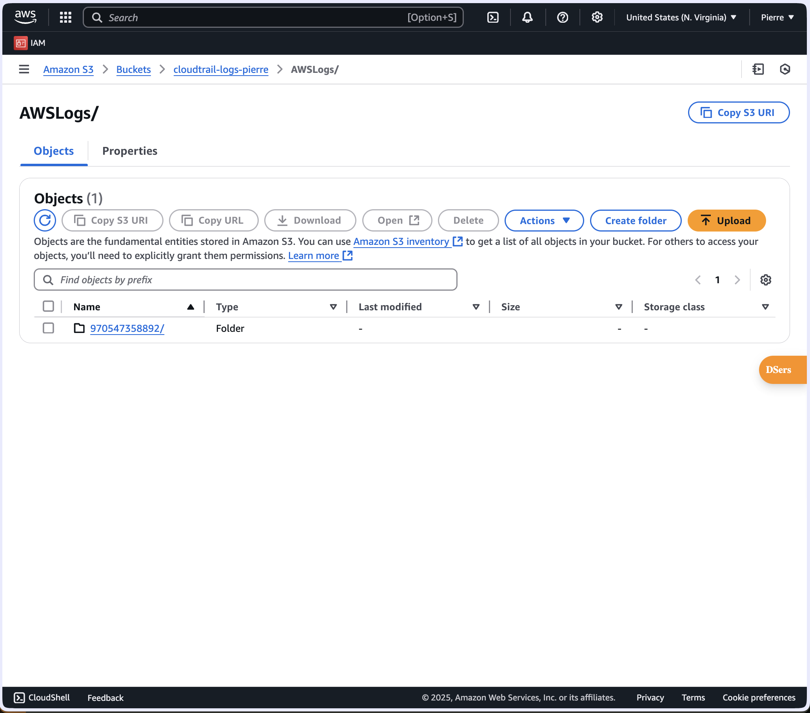

# Secure AWS S3 Bucket Setup

## 🚀 Project Overview

This project provides a Bash script to create and configure a highly secure AWS S3 bucket using the AWS CLI. The script ensures that the bucket is protected with encryption, restricted public access, and enforced HTTPS-only connections. Additionally, it enables AWS CloudTrail logging to monitor all S3 access activities.

## Screenshots
<div align="row">
 
 
</div>

## 🛠️ Features

- ✅ **Creates a secure S3 bucket**
- ✅ **Blocks all public access**
- ✅ **Forces encryption with AES-256**
- ✅ **Restricts access to HTTPS-only**
- ✅ **Enables AWS CloudTrail logging for security monitoring**

## 📜 Prerequisites

Before running this script, ensure you have:

- An AWS account  
- AWS CLI installed ([Download Here](https://aws.amazon.com/cli/))  
- AWS credentials configured using:

  ```sh
  aws configure

🚀 Usage

### Step 1: Clone the Repository

`git clone https://github.com/Pmvita/aws-secure-s3.git`
`cd aws-secure-s3`

### Step 2: Make the Script Executable

`chmod +x secure_s3_setup.sh`

### Step 3: Run the Script

`./secure_s3_setup.sh`

### Step 4: Apply CloudTrail Fix (If Necessary)

If you get an `AccessDenied` error while setting up CloudTrail logging, use the following commands:

```sh
aws s3api put-public-access-block --bucket cloudtrail-logs-pierre --public-access-block-configuration '{
    "BlockPublicAcls": true,
    "IgnorePublicAcls": true,
    "BlockPublicPolicy": false,
    "RestrictPublicBuckets": true
}'

aws s3api put-bucket-policy --bucket cloudtrail-logs-pierre --policy '{
    "Version": "2012-10-17",
    "Statement": [
        {
            "Effect": "Allow",
            "Principal": { "Service": "cloudtrail.amazonaws.com" },
            "Action": "s3:PutObject",
            "Resource": "arn:aws:s3:::cloudtrail-logs-pierre/AWSLogs/970547358892/*",
            "Condition": { "StringEquals": { "s3:x-amz-acl": "bucket-owner-full-control" } }
        },
        {
            "Effect": "Allow",
            "Principal": "*",
            "Action": "s3:GetBucketAcl",
            "Resource": "arn:aws:s3:::cloudtrail-logs-pierre"
        }
    ]
}'

aws s3api put-public-access-block --bucket cloudtrail-logs-pierre --public-access-block-configuration '{
    "BlockPublicAcls": true,
    "IgnorePublicAcls": true,
    "BlockPublicPolicy": true,
    "RestrictPublicBuckets": true
}'
```

### Step 5: Verify in AWS Console
	•	Go to AWS S3 → Check that your bucket is created and encrypted.
	•	Go to AWS CloudTrail → Check that logging is enabled.

📂 Script Breakdown

This script performs the following actions:
 1. Creates a new S3 bucket with a unique name.
 2. Blocks all public access to prevent unauthorized access.
 3. Enforces AES-256 encryption to protect data at rest.
 4. Forces HTTPS-only connections to secure data in transit.
 5. Creates a CloudTrail logging bucket for monitoring access logs.
 6. Enables CloudTrail logging to track all operations on the S3 bucket.

📦 Expected Output

When the script runs successfully, you should see output similar to:

```json
{
    "Location": "/secure-s3-pierre"
}
{
    "Location": "/cloudtrail-logs-pierre"
}
```
✅ **Secure AWS S3 bucket setup completed!**

📜 License

This project is licensed under the [MIT License](https://opensource.org/licenses/MIT) – feel free to use and modify!

⸻

### 🔹 Author: Pierre Mvita
-  🔗 GitHub: [Pmvita](https://github.com/Pmvita)
-  🔗 LinkedIn: [Pierre Mvita](https://www.linkedin.com/in/pierre-mvita)

⸻
